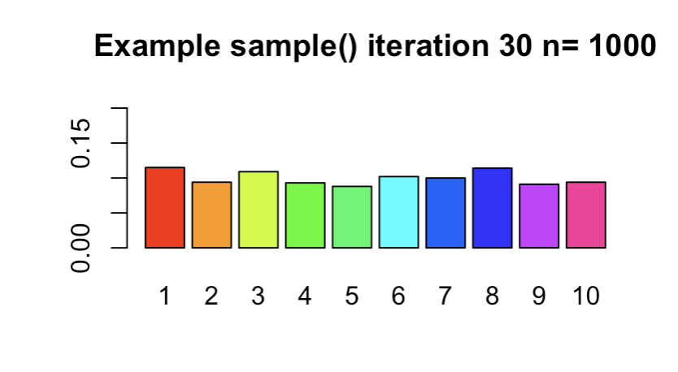

# Tasks 

## Task 1
```{r}
getwd()
```

## Task 2

```{r} 
mybin=function(iter=100,n=10, p=0.5){ 
# make a matrix to hold the samples
#initially filled with NA's
sam.mat=matrix(NA,nr=n,nc=iter, byrow=TRUE)
#Make a vector to hold the number of successes in each trial
succ=c()
for( i in 1:iter){
#Fill each column with a new sample
sam.mat[,i]=sample(c(1,0),n,replace=TRUE, prob=c(p,1-p))
#Calculate a statistic from the sample (this case it is the sum)
succ[i]=sum(sam.mat[,i])
}
#Make a table of successes
succ.tab=table(factor(succ,levels=0:n))
#Make a barplot of the proportions
barplot(succ.tab/(iter), col=rainbow(n+1), main="Binomial simulation", xlab="Number of successes")
succ.tab/iter
}
```


```{r} 
mybin(iter=100,n=10, p=0.7) 
mybin(iter=200,n=10, p=0.7)
mybin(iter=500,n=10, p=0.7)
mybin(iter=1000,n=10, p=0.7)  
mybin(iter=10000,n=10, p=0.7) 

calculation <- mybin(iter=10000,n=10, p=0.7)

```


mybin(),Iterations = 10,000: 
     0      1      2      3      4      5      6      7 
0.0000 0.0000 0.0010 0.0085 0.0374 0.1077 0.1948 0.2710 
     8      9     10 
0.2269 0.1254 0.0273 

```{r} 
theoretical <- dbinom(0:10,size=10,p=0.7)
```
dbinom(): 
 [1] 0.0000059049 0.0001377810 0.0014467005 0.0090016920
 [5] 0.0367569090 0.1029193452 0.2001209490 0.2668279320
 [9] 0.2334744405 0.1210608210 0.0282475249
```{r}
for (i in 0:10) {
  cat(sprintf("Order: %d, Simulated: %.4f, Theoretical: %.4f\n", i, calculation[i+1], theoretical[i+1]))
}  
for (i in 0:10) {
  cat(sprintf("Order: %d, Difference: %.4f\n", i, calculation[i+1]-theoretical[i+1]))
}
```

## Task 3

```{r}
sample(c(rep(1, 12), rep(0, 8)),size=5, replace=FALSE) 
sample(c(1,0),size=20,prob=c(3/5,2/5), replace=TRUE) 
```

```{r} 
myhyper=function(iter=100,N=20,r=12,n=5){
# make a matrix to hold the samples
#initially filled with NA's
sam.mat=matrix(NA,nr=n,nc=iter, byrow=TRUE)
#Make a vector to hold the number of successes over the trials
succ=c()
for( i in 1:iter){
#Fill each column with a new sample
sam.mat[,i]=sample(rep(c(1,0),c(r,N-r)),n,replace=FALSE)
#Calculate a statistic from the sample (this case it is the sum)
succ[i]=sum(sam.mat[,i])
}
#Make a table of successes
succ.tab=table(factor(succ,levels=0:n))
#Make a barplot of the proportions
barplot(succ.tab/(iter), col=rainbow(n+1), main="HYPERGEOMETRIC simulation", xlab="Number of successes")
succ.tab/iter
}

```

```{r}
myhyper(iter=100,N=20,r=12,n=5) 
myhyper(iter=200,N=20,r=12,n=5) 
myhyper(iter=500,N=20,r=12,n=5) 
myhyper(iter=1000,N=20,r=12,n=5) 
myhyper(iter=2000,N=20,r=12,n=5) 
calculation2 <- myhyper(iter=2000,N=20,r=12,n=5) 
```

```{r} 
theoretical2 <- dhyper(0:5,m=12,n=8,k=5)
```
```{r}
for (i in 0:5) {
  cat(sprintf("Order: %d, Simulated: %.4f, Theoretical: %.4f\n", i, calculation2[i+1], theoretical2[i+1]))
}  
for (i in 0:5) {
  cat(sprintf("Order: %d, Difference: %.4f\n", i, calculation2[i+1]-theoretical2[i+1]))
}
```
## Task 4


```{r}
mysample=function(n, iter=10,time=0.5){
  for( i in 1:iter){
  #make a sample
  s=sample(1:10,n,replace=TRUE)
  # turn the sample into a factor
  sf=factor(s,levels=1:10)
  #make a barplot
  barplot(table(sf)/n,beside=TRUE,col=rainbow(10), 
  main=paste("Example sample()", " iteration ", i, " n= ", n,sep="") ,
  ylim=c(0,0.2)
) 
  
#release the table
Sys.sleep(time)
}
}
``` 
The above is the mysample() function. I believe that the my sample function is used to choose n values from 1 to 10 and then convert them into these data structures called factors. The factors are then represented via a barplot. 


```{r} 
p <- invisible(mysample(n=1000,iter=30,time=1))

```


I see 30 bar graphs with different frequencies of the values from 1 to 10. Some bars are clearly larger than others which shows that even though we'd expect the bars to be of equal length, because of random independent choosing, any of the bars can be chosen multiple times. This clearly shows that if we did want the frequencies to be similar then we need a larger n in order to have a more equal distribution. 

{ width=70% }

## Task 5

```{r} 
choose(8,4)
``` 


This is how we'd choose 4 values out of 8 elements. 


```{r} 
?ppois
1 - ppois(4, 2)
```


We do 1-ppois because the ppois function is set to find P(X>=x) and the opposite of this is < than. 

```{r}
dnbinom(10,size=3,prob=0.4)
```


```{r}
pbinom(q=8,size=15,prob = 0.4)
```

## Task 6 
```{r}
MATH4753DPAI24::mybin(iter=1000,n=10,p=0.7) 
```


The above is our function mybin() which produces the binomial distribution probabilities and the colorful bar graph representing these values using a manual calculation. 


